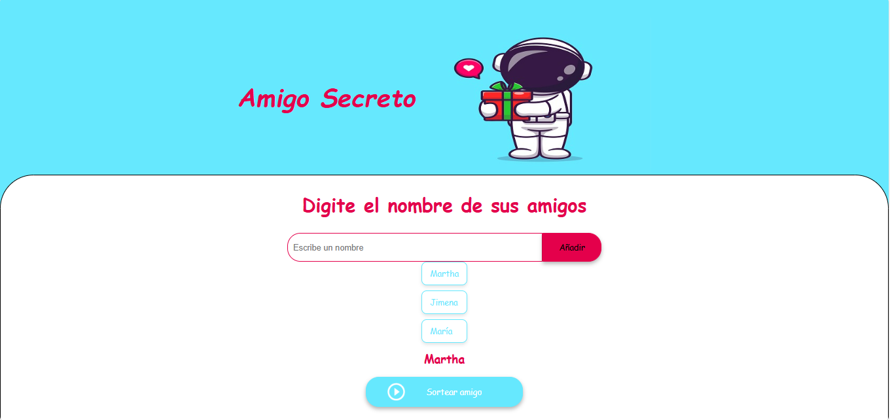

# Amigo Secreto

Este es un proyecto simple en **JavaScript**, **HTML** y **CSS** que permite agregar una lista de nombres y realizar un sorteo aleatorio para elegir un "amigo secreto".

## 🚀 Funcionalidades

- **Agregar amigos**: 
  - El usuario escribe un nombre en el campo de entrada.
  - Si el nombre no está vacío y no ha sido agregado previamente, se añade a la lista.
  - Los nombres duplicados no se permiten.

- **Visualización**:
  - Cada amigo agregado aparece en una lista en pantalla.

- **Sorteo**:
  - El programa selecciona de forma aleatoria uno de los amigos de la lista.
  - El nombre sorteado se muestra en el área de resultado.

## 🛠️ Tecnologías utilizadas

- **HTML5** → Estructura de la página.
- **CSS3** → Estilos y diseño responsivo.
- **JavaScript (Vanilla)** → Lógica para agregar y sortear amigos.

-**Función agregarAmigo()**:
    Toma el valor del campo de entrada.
    Valida que no esté vacío.
    Evita agregar nombres duplicados.
    Inserta el nombre en la lista HTML.

-**Función sortearAmigo()**:
    Valida que existan nombres en la lista.
    Genera un índice aleatorio.
    Muestra en pantalla el amigo sorteado.
    
▶️ Uso:
    Abre el archivo index.html en tu navegador.
    Escribe el nombre de un amigo en el campo de texto.
    Haz clic en "Agregar" para incluirlo en la lista.
    Repite el proceso para varios amigos.
    Haz clic en "Sortear" para elegir un amigo secreto al azar.

📸 Ejemplo visual:

📌 Notas
    Este proyecto es ideal para practicar JavaScript básico, manipulación del DOM y validaciones.
    Se puede mejorar añadiendo:
    Estilos más avanzados.
    Persistencia con LocalStorage.
    Funcionalidad para eliminar nombres de la lista.